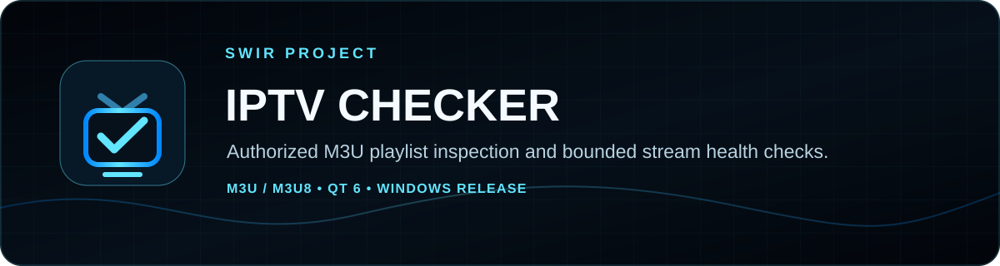
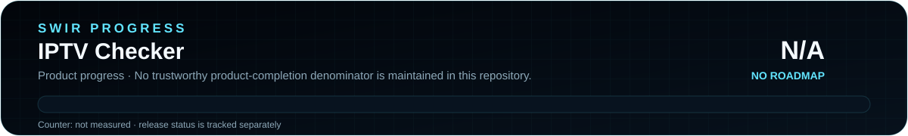

<!-- SWIR-README-STANDARD:v2 -->

<div align="center">



# IPTV Checker 2.0

**Inspect authorized M3U/M3U8 playlists, check endpoint health, filter results, export reports and open selected streams in VLC.**


[](https://github.com/Swir)
[](https://github.com/Swir/IPTV-checker/stargazers)

[**Highlights**](#-highlights) · [**Quick Start**](#-quick-start) · [**Checking model**](#-how-stream-checking-works) · [**Releases**](#-releases) · [**Responsible use**](#-responsible-use-and-limitations)

</div>


## 📍 Project Status

<p align="center">
  
</p>

| Item | Status |
|---|---|
| Current stage | Maintained 2.0 desktop utility |
| Source runtime | Python 3.11–3.14 |
| Published package | Windows x64 [`v2.0.0`](https://github.com/Swir/IPTV-checker/releases/tag/v2.0.0) |
| Languages | English, Polish, Norwegian; English fallback |
| Product progress | **N/A** — no authoritative product-completion roadmap is maintained |
| CI | Parser tests are configured for Python 3.11, 3.12, 3.13 and 3.14 |

<p align="center">
  
</p>

The SVG progress assets intentionally show **N/A**, not 0%, because the repository has no trustworthy denominator for overall product completion. Release availability and stream-health percentages are separate concepts.

## 🚀 Overview

**IPTV Checker** is a Qt 6 desktop application for inspecting M3U/M3U8 playlists that you explicitly load. It parses channel metadata, performs bounded HTTP health checks in a background workflow, filters the results, exports reports or a cleaned playlist, and can open a selected stream in VLC.

The project does **not** provide IPTV subscriptions, credentials, accounts, playlists or third-party access.

## ✨ Highlights

| Feature | What it does |
|---|---|
| 📚 Remote and local playlists | Load multiple remote M3U/M3U8 sources or drag local playlist files into the app. |
| 🧾 M3U metadata | Parse channel name, group, `tvg-id`, `tvg-name` and `tvg-logo`. |
| 🌐 Bounded health checks | Probe only URLs from user-loaded playlists with a limited read, timeout and capped concurrency. |
| 📊 Useful diagnostics | Record online/offline state, HTTP status, latency and content type. |
| 🔎 Live filtering | Filter by channel name, group and health status. |
| 🧹 Duplicate handling | Detect and remove duplicate entries. |
| 📤 Export | Save current results to CSV/JSON or export the filtered result as M3U. |
| ▶️ VLC hand-off | Discover VLC automatically or use a saved path to open the selected stream. |
| 🌍 EN / PL / NO | Detect the system language and fall back to English. |
| 🔐 Safer display | Hide URL user-info and query data in the table presentation. |

## ⚙️ Quick Start

### Recommended — Windows release

Download `IPTV-Checker-2.0.0-Windows-x64.exe` from [release v2.0.0](https://github.com/Swir/IPTV-checker/releases/tag/v2.0.0). The release also includes a SHA-256 sidecar for the EXE.

### From source

```bash
git clone https://github.com/Swir/IPTV-checker.git
cd IPTV-checker
python -m pip install -r requirements.txt
python run.py
```

Alternative launcher:

```bash
python -m iptv_checker
```

The legacy `checker.py` and `checker english.py` files remain compatibility launchers. The current application detects the supported system language automatically.

## 📋 Requirements / Compatibility

| Component | Scope |
|---|---|
| Python | `>=3.11,<3.15` |
| GUI | PySide6 / Qt 6 |
| Networking | aiohttp |
| Optional playback | VLC for the **Open in VLC** action |
| Published binary | Windows x64 v2.0.0 |
| Source environments | The code is written for Python desktop environments; packaged Linux/macOS releases are not published here |

## 🧪 How stream checking works

Checks run only for stream URLs discovered in playlists that the user explicitly loads. The current network layer:

- accepts HTTP/HTTPS stream URLs;
- caps concurrency at **8**;
- clamps a per-run timeout to at most **30 seconds**;
- sends a `Range: bytes=0-511` request;
- reads at most **512 bytes** from each checked stream;
- records HTTP status, content type and measured latency;
- follows normal redirects.

A successful health check means the endpoint responded during the test. It does **not** guarantee continuous playback, codec support, long-term availability or authorization.

## 🎮 Main Workflow

1. Add one or more authorized remote playlist URLs or drag local `.m3u` / `.m3u8` files into the application.
2. Parse and inspect channel metadata.
3. Run bounded health checks for the loaded entries.
4. Filter or remove duplicates.
5. Export results as CSV/JSON, save a filtered M3U, or open a selected stream in VLC.

## 🧠 Technology / Architecture

| Layer | Technology / role |
|---|---|
| UI | PySide6 / Qt 6 |
| Playlist parser | `iptv_checker/parser.py` |
| Network checks | aiohttp in `iptv_checker/network.py` |
| Localization | `iptv_checker/i18n.py` |
| Packaging | PyInstaller through GitHub Actions |
| Verification | pytest parser tests and project CI |

The source is split into parser, network, localization, theme, model and application modules rather than the earlier single-file layout.

## 🛠️ Build Windows EXE

The repository includes Windows build/release workflows. For a local PyInstaller build:

```bash
python -m pip install -r requirements-dev.txt
python scripts/make_icon.py
pyinstaller --noconfirm --clean --onefile --windowed --name IPTV-Checker --icon assets/icon.ico --add-data "assets/icon.svg;assets" run.py
```

## 🗺️ Roadmap / Progress

There is currently **no authoritative product roadmap** with a reproducible completion denominator. The SWIR progress SVG therefore reports **N/A**. Planned ideas in the older README remain ideas rather than completed-roadmap percentages:

- optional channel-logo preview cache;
- check history and run-to-run comparison;
- playlist diff;
- optional in-app scheduled re-checks;
- additional translations.

## 📦 Releases

The current maintained release is **[IPTV Checker 2.0.0 — Windows](https://github.com/Swir/IPTV-checker/releases/tag/v2.0.0)**, published on September 16, 2026. It provides the Windows x64 EXE and an SHA-256 checksum asset.

Older historical releases remain available in [GitHub Releases](https://github.com/Swir/IPTV-checker/releases) but are not presented as the current recommended build.

## ⚠️ Responsible Use and Limitations

- Use IPTV Checker only with playlists and streams you are authorized to access.
- The application does not grant access to subscription services or bypass authentication.
- An `online` result is only an endpoint-health observation at one moment.
- Health checking does not validate media codecs, DRM, licensing, sustained throughput or uninterrupted playback.
- Do not interpret the N/A project-progress graphic as a stream-health result or release-readiness score.

## 🧩 Project Structure

```text
IPTV-checker/
├── iptv_checker/
│   ├── app.py
│   ├── i18n.py
│   ├── models.py
│   ├── network.py
│   ├── parser.py
│   ├── theme.py
│   └── __main__.py
├── assets/
│   ├── icon.svg
│   └── readme/
├── scripts/
│   └── make_icon.py
├── tools/
│   └── generate_readme_progress.py
├── tests/
│   └── test_parser.py
├── .github/workflows/
├── run.py
├── pyproject.toml
└── requirements.txt
```

## 🔎 Search Keywords

`IPTV checker` • `M3U playlist checker` • `M3U8 inspector` • `stream health checker` • `PySide6 IPTV tool` • `Qt6 playlist inspector` • `authorized IPTV diagnostics` • `VLC playlist launcher` • `M3U metadata parser` • `HTTP stream status checker` • `Python IPTV utility` • `M3U CSV JSON export`


<div align="center">


### `LOAD • FILTER • CHECK • EXPORT • PLAY`

**IPTV Checker — by Swir**

[**← SWIR profile**](https://github.com/Swir) · [**All projects →**](https://github.com/Swir?tab=repositories) · [**Releases**](https://github.com/Swir/IPTV-checker/releases)

</div>
